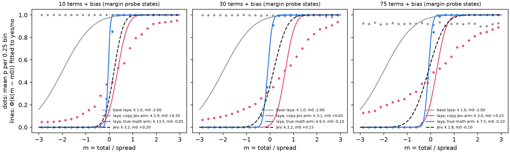
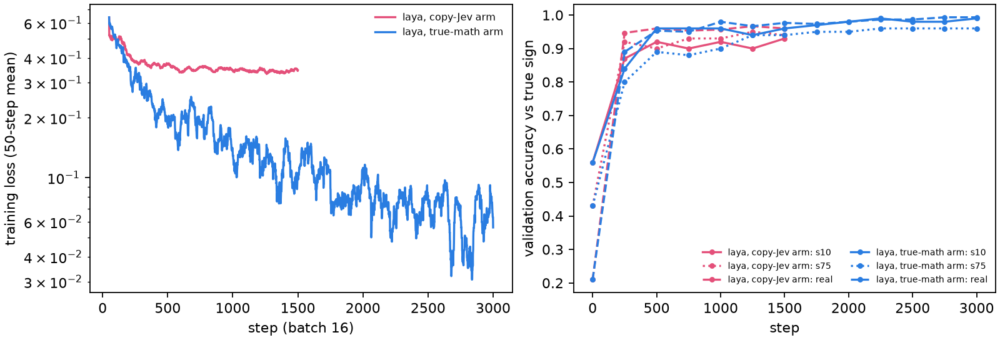
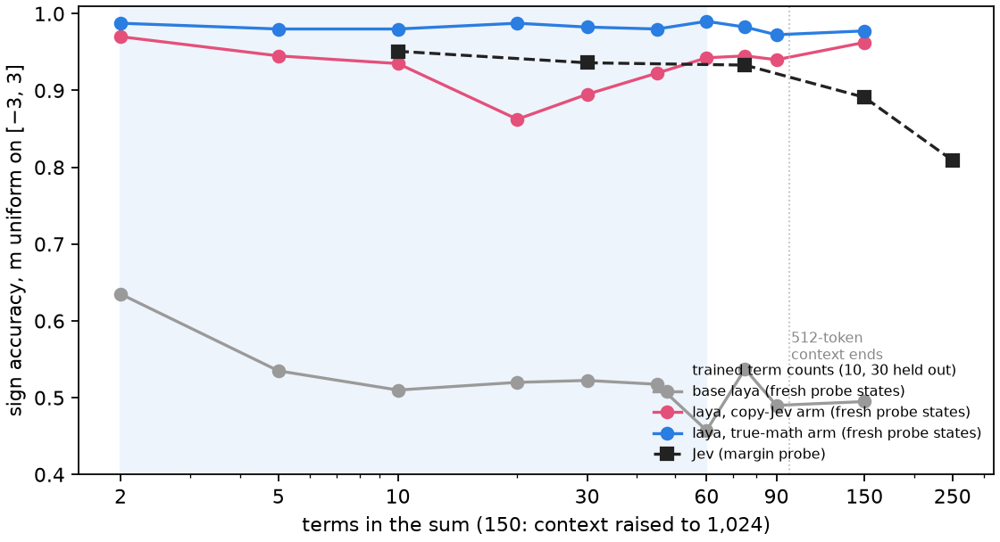
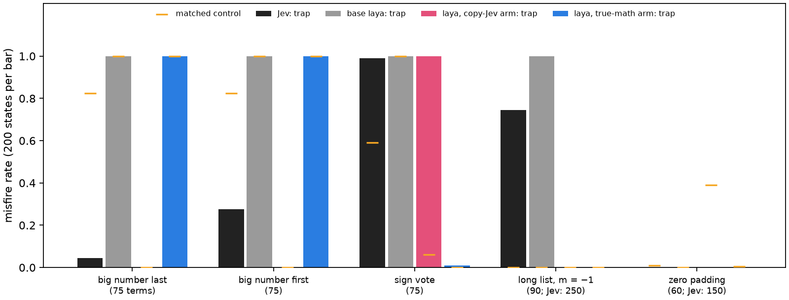

# Stage 10: teaching laya to add

2026-09-27 · all local (PyTorch on the M5 Pro's GPU, Ollaya) · no Jev calls · $0

Yes: a 421M-parameter System-1 model can be taught to be a neuron, and it ends up a better one than Jev. Base laya answers yes to every folded sum (48-53% sign accuracy). After 3,000 fine-tuning steps (1.9 hours) on synthetic and journaled states labelled with the true sign, it gets 98.7%, 97.3% and 97.5% of the margin probe's own 10-, 30- and 75-term states right, where Jev got 94.7%, 93.8% and 93.8% of the same states. Its response curve is 2-4× steeper (k 13.5 / 6.5 / 7.5 against Jev's 2.9 / 2.3 / 1.9), and it holds 97-98% at 75 and 90 terms, which it never trained on, and at 150 terms with the context raised past Ollaya's 512 tokens. It serves through Ollaya as `laya-neuron` with answers identical to the offline model. A sparse 3 vs 8 network trained on an exact neuron loses 1 point when laya-neuron replaces it (91.2% to 90.2%); on Jev, stage 5's dense network lost 25 points.

It isn't a perfect adder. One trap family breaks it completely: a single large positive number against 74 small negatives, total half a spread below zero, fires 100% of the time. The pilot model had a different hole (it counted signs), which more varied training data closed.

Code: `laya/` (its own uv environment; commands in `laya/README.md`). Checkpoints, logs, evaluations: `runs/stage10/`.

## laya, and reproducing Ollaya

laya (convaiinnovations/laya, Apache-2.0) is ModernBERT-large (28 layers, 395M) plus a 2-layer transformer decision head, 421M in all. It never generates text. The input is `[CLS] noul question: <instructions> [SEP] [MASK] false: <criteria.false> [MASK] true: <criteria.true> [SEP] <state as JSON> [SEP]`, each `[MASK]` is scored by a small MLP, the two scores are divided by a fixed noul temperature of 1.983 and softmaxed, and the `true` probability is the noul answer. Ollaya's `laya:en` serves the same weights (identical sha256 to the Hugging Face file) through MLX on Metal in fp32.

`laya/laya_model.py` wraps laya's own `rl_common.py` and `rl_agent_api.py` from the model repo. On 25 states (scalar and folded, 2 to 60 terms) it reproduced Ollaya's answers to within 4.9e-5, which is Ollaya's 4-decimal rounding, with identical token counts. bf16 weights crash MPS; bf16 autocast over fp32 weights works and is what training uses.

The 512-token context takes 43 tokens of question and options, and a folded state costs about 4.6 tokens per number. Probe-style states fit up to about 99 terms (p99 of 90 terms is 471 tokens). Ollaya silently truncates a longer state; the evaluation skips such states instead, and none of the ones reported here needed skipping.

## Setup

Every state is exactly what `states.neuron_state("folded", x, w, b)` produces, asked with `states.neuron_question("folded")`, unchanged. The coordinator's measurement that a neutral two-option choice fixes base laya's scalar answers but not its folded sums was noted; since fine-tuning retrains the head anyway, the noul question stays, so the Jev client sends the same request to laya-neuron as to Jev.

Synthetic states, with term counts 2 to 60 except 10 and 30, margins m = z / spread uniform on [−3, 3] (capped at what k + 1 numbers allow), label = true sign of the rounded total. Three families:

- probe: MNIST pixel values times N(0, s) weights at two decimals, a bias, weights shifted to hit the target margin (the margin probe's construction, with varied weight scales and biases)
- generic: heavy-tailed numbers with no MNIST structure, shifted to the target
- mixed: the number of positive terms drawn independently of the total, two groups scaled to the target margin. Added after the pilot, below.

Real states: 457,958 distinct folded states from the stage 2, 3, 5 and 6 journals (stage 6 from the 20:46 backup), the stage 1 wording probe and the backend check, 2 to 97 numbers each, with Jev's mean p. 10% are held out by state hash. The margin probe's 1,800 states are held out entirely, since they define Jev's published curve.

Two arms, full fine-tune from laya's weights, AdamW 2e-5 with warmup and cosine decay, batch 16, gradient checkpointing, bf16 autocast, loss = cross-entropy on the calibrated probability softmax(logits / 1.983), so the number Ollaya reports is the number trained:

| Arm | Data | Label | Steps | Time | Peak MPS memory |
| --- | --- | --- | --- | --- | --- |
| Pilot (true math) | 70% synthetic (probe 75%, generic 25%), 30% real | true sign | 1,000 | 49 min | 19.5 GB |
| True math | 70% synthetic (probe 50%, generic 20%, mixed 30%), 30% real | true sign | 3,000 | 1 h 51 min | 17.8 GB |
| Copy Jev | real only | Jev's mean p (soft) | 1,500 | 1 h 14 min | 17.4 GB |

Steps took 1.8-2.4 s alone on the GPU and up to 5 s when an evaluation or another Ollaya run shared it. The official fine-tuning notebook uses REINFORCE against proper scoring rules, then refits a temperature. Cross-entropy is the log score's expected-value form, and holding the temperature fixed keeps Ollaya's calibration layer valid, so neither step was needed.

The true-math arm reached Jev's accuracy within 250-500 steps (4,000-8,000 states). Validation accuracy on 10-, 30- and 75-term states and held-out real states was 84/82/80/89% at step 250, 96/97/89/95% at 500, and 99/98/96/99% at 3,000.

## Response curves against Jev

P(fire) = Φ(k(m − m0)) fitted by maximum likelihood to yes/no answers, per term count. The Jev row is the published margin-probe fit; refitting it on the same deduplicated states with Jev's mean p gives k 2.9 / 2.3 / 1.9 and m0 +0.20 / +0.15 / −0.15.

| Terms (+ bias) | Jev: k, m0, sign accuracy | Base laya | Copy-Jev arm | True-math arm |
| --- | --- | --- | --- | --- |
| 10 (held out) | 3.2, +0.20, 94.7% | fires always, 48.3% | 2.9, +0.35, 93.0% | 13.5, −0.05, 98.7% |
| 30 (held out) | 2.2, +0.15, 93.8% | fires always, 53.0% | 3.1, +0.65, 88.7% | 6.5, −0.10, 97.3% |
| 75 (never trained) | 1.8, −0.10, 93.8% | fires always, 50.7% | 3.0, +0.25, 95.8% | 7.5, −0.10, 97.5% |

Same 600 states per row for every model. Jev's accuracy here is on the deduplicated states with its mean p; the published per-call figures are 95.1 / 93.6 / 93.3%.

Fresh states from the margin probe's generator (seed 99, 400 per count; 2 and 5 terms use the training generator, because the probe's can't reach |m| = 3 with so few numbers):

| Terms | 2 | 5 | 10 | 20 | 30 | 45 | 60 | 75 | 90 | 150* |
| --- | --- | --- | --- | --- | --- | --- | --- | --- | --- | --- |
| Base laya | 63.5% | 53.5% | 51.0% | 52.0% | 52.3% | 51.8% | 45.8% | 53.8% | 49.0% | 49.5% |
| Copy-Jev arm | 97.0% | 94.5% | 93.5% | 86.3% | 89.5% | 92.3% | 94.3% | 94.5% | 94.0% | 96.3% |
| True-math arm | 98.8% | 98.0% | 98.0% | 98.8% | 98.3% | 98.0% | 99.0% | 98.3% | 97.3% | 97.8% |
| Jev (margin probe) | | | 95.1% | | 93.6% | | | 93.3% | | 89.1% |

\* 150 terms needs about 740 tokens, so the context was raised to 1,024 for this column only. Ollaya's `laya:en` can't serve it. ModernBERT's encoder accepts 8,192 tokens and the fine-tuned model was never shown more than 512, yet it held 97.8% (fitted k 5.1, m0 −0.15). Jev gets 89.1% at 150 and 80.9% at 250.

The true-math arm has a slight yes-lean (m0 −0.05 to −0.15, fires on 2-5% of negative totals) and no length decay through 150 terms. Holding out 10 and 30 terms is a weak test, since 9, 11, 29 and 31 were trained. The real length test is 75, 90 and 150, all past the longest trained sum.

On 6,000 held-out real journal states (72% stage 6 output neurons, mostly 33 numbers), the true-math arm gets the sign right 99.1% of the time, against 97.6% for Jev's own recorded answers. It gains most on stage 3's small circle networks (97.5% vs 92.8%).

## The copy-Jev arm

Trained on Jev's p, laya learns Jev closely on the kind of states it saw. On held-out real states it agrees with Jev's yes/no 98.2% of the time with a mean |p − p_jev| of 0.028, which is about Jev's own repeat noise (identical calls flip 1.6-3.1%). It matches Jev's accuracy per source (97.7% vs 97.6% overall).

It copies Jev's p less well off that distribution. The random probe states look nothing like trained-network states, and there it agrees 89-95% and fires later than Jev (m0 +0.25 to +0.65 against Jev's −0.15 to +0.20). Its p is graded like Jev's (the dots in the curve figure), not a step. It also copied Jev's sign vote (below), which the true-math arm had to be taught out of.

## Traps

Stage 6b's trap families at their original 75 terms, and length-limited versions of the two that don't fit 512 tokens. Jev's long-list and zero-padding numbers are from 250 and 150 terms, so they aren't the same states. Misfire = yes/no disagrees with the true sign; 200 trap states and 200 matched controls per family.

| Family | Jev: trap / control | Base laya | Pilot (1,000 steps, no mixed family)† | Copy-Jev arm | True-math arm |
| --- | --- | --- | --- | --- | --- |
| One big +4.9 last, 74 small negatives, m = −0.5 | 4.5% / 82.5% (big one mid-list) | 100 / 100% | 0 / 0% | 0 / 0% | 100 / 100% |
| Same, big one first | 27.5% / 82.5% | 100 / 100% | 0 / 0% | 0 / 0% | 100 / 100% |
| Sign vote: 60 small +, 15 large −, m = −0.5 | 99.0% / 59.0% | 100 / 100% | 95.5 / 0% | 100 / 6% | 1 / 0% |
| Long list, m = −1 (90 terms; Jev 250) | 74.5% / 0% | 100 / 0% | 0 / 0% | 0 / 0% | 0 / 0% |
| Zero padding: 20 real + 40 zeros, m = +0.3 (Jev 40 + 110) | 0% / 1% | 0 / 0% | 0 / 8% | 0 / 39% | 0 / 0.5% |

† The pilot's evaluation crashed at its final speed test, after every other number was printed, so its results are in `runs/stage10/eval-pilot-truth.log` and not in a JSON file or the figure.

The pilot learned to count signs. Its synthetic states were built by shifting every weight toward the target margin, which ties the share of positive terms to the total (correlation 0.85 between sign vote and m in the probe family), and the model found that shortcut: 95.5% misfires on the vote trap with a clean control. The mixed family draws the positive count independently of the total (correlation 0.45 after the margin constraint), and the final true-math model misfires on 1% of vote traps. The mixed family resembles the vote trap's construction, so that trap is no longer fully held out for the final model.

The final model picked up a different hole. With one large positive number (98% of the spread) and 74 small negatives each around −0.1, it answers yes every time, wherever the big number sits, including the control where Jev fails. A follow-up check narrowed it down. The same construction with 10 or 30 small numbers is answered 100% correctly, as are its mirror image (one big negative, 74 small positives) and the version at m = −1.5. So it fails to accumulate many small negatives against one large positive near the boundary on long lists, and it does this deterministically. The pilot didn't have this hole. No training data targeted it, and it wasn't fixed here.

The copy-Jev arm reproduced Jev's sign vote (100% on the trap) but none of Jev's other quirks: it gets the position traps and the long list right and has no yes-lean. Those quirks show up on states unlike the trained-network states it learned from.

## Scalar sweep

z in [−10, 10] at 0.1, never trained:

| Question | Base laya | Copy-Jev arm | True-math arm | Jev (stage 1) |
| --- | --- | --- | --- | --- |
| "z is a number." / greater than zero / zero or less | 51.7% | 100% | 100% | 0% on negatives (p 0.66-0.74) |
| "Is the number z positive?" | 50.2% | 91.0% | 99.5% | 100% |
| `{"products": [z]}`, folded question | 94.0% | 100% | 100% | |

Fine-tuning on the folded question carried over to the scalar wordings, including the one that fooled Jev.

## Speed

On the idle GPU, one call at a time through Ollaya: median 18 ms at 10 terms, 28 ms at 30 and 59 ms at 75, the same as base `laya:en`. With 8 client threads Ollaya serves 57, 37 and 18 calls/s. Offline PyTorch batched at 64 manages 81, 41 and 19 states/s. Jev's median is 0.13-0.16 s per call regardless of length, and its two backends allow about 68 calls/s together. So laya-neuron is 2-9× faster per call and free, but on long sums its throughput is below what the Jev backends allow. The payoff's 115,500 calls took 56 minutes of GPU time.

## Serving

Ollaya 0.7.2's Modelfile accepts only `FROM <registry name>`, `PARAMETER precision`, `QUESTIONS`, `CALIBRATION` and `LICENSE`, so `ollaya create` can't swap in new weights, and no ONNX export is needed either: `laya:en` runs through MLX from its safetensors weights layer. `laya/install_ollaya.py truth laya-neuron` does what `create` would. It copies `laya:en`'s manifest, points the weights layer at the fine-tuned safetensors (same keys and dtypes, so the same arch, tokenizer and calibration layers apply), and writes the blob and manifest into Ollaya's store. `laya:en` is untouched, `ollaya rm laya-neuron` undoes it, and the running server picked it up without a restart.

`src/jevrons/jev.py` has a new backend entry, `ollaya-laya-neuron` (model `laya-neuron`, served as `laya-neuron:latest`, default off). `laya/client_check.py` sent the margin probe's 1,800 states and the 201-point scalar sweep through `Jev(journal, backends=["ollaya-laya-neuron"])`. Every answer matched the offline model to within 6e-5, the fitted curves were identical (k 13.5 / 6.5 / 7.5), and the scalar sweep scored 100%. Journal: `runs/stage10/client/journal.jsonl`.

## Payoff: sparse 3 vs 8 through the laya neuron

Stage 5's recipe (784-32-1, 500 train / 500 val, straight-through with τ = 3, Adam 0.02, batch 32, 5 epochs, `stage5.init(0)`). Each hidden neuron keeps its 64 largest-magnitude initial weights among the 379 pixels that are nonzero in at least 5% of training images, and the rest stay at zero, so hidden states carry 35 terms on average and at most 54 plus the bias. Both arms share the start and the mask. laya is deterministic, so one validation pass replaces stage 5's two.

| Arm | Exact neuron | laya-neuron | Hidden fires as intended | Output fires as intended |
| --- | --- | --- | --- | --- |
| Trained through laya-neuron | 90.6% | 91.0% | 95.7% | 93.8% |
| Trained exact, swapped to laya-neuron | 91.2% | 90.2% | 95.5% | 95.8% |
| Stage 5, trained through Jev (dense, ~150 terms) | 94.4% | 94.2% | 93.0% | 97.5% |
| Stage 5, trained exact, swapped to Jev | 92.8% | 67.8% | 86.9% | 91.6% |

The swap control is the result. On Jev, an exact-trained network lost 25 points, and training through Jev was how stage 5 got them back. On laya-neuron, it loses 1 point, and training through the neuron adds only 0.8. laya-neuron behaves close enough to the intended step neuron that nothing needs compensating.

Absolute accuracy is lower than stage 5's because the network is sparser: the exact-step ceiling with 64 weights per hidden neuron is 91.2%, against 92.8% dense. This isn't a like-for-like comparison with Jev, which was never run on the sparse network.

## Downloads

From Hugging Face, only laya's code and small configs at revision `aa8c91ca` (`rl_common.py`, `rl_agent_api.py`, configs, README): 53 KB. The 843 MB weights file and the tokenizer were already in Ollaya's store under the same sha256 as the Hugging Face LFS objects, so `laya/hf/` symlinks to them and nothing large was downloaded. torch 2.14.0 and transformers 5.17.0 came from the local uv cache (the environment is 817 MB on disk, and no packages were fetched from the network). The fine-tuning notebook (40 KB) was read for reference and not kept.

## Caveats

- One seed per arm and one payoff run. The curves use 400-600 states per term count, so an accuracy of 97.5% has a 95% interval of about ±1.3 points.
- The synthetic distribution was changed once after looking at a trap result, and the change resembles the vote trap. The final model's vote-trap number isn't a clean held-out test. The position traps were, and the final model fails them.
- The stage 6b comparison is uneven: Jev's long-list and zero-padding traps used 250- and 150-term lists, laya's used 90 and 60.
- The true-math arm's p is nearly a step: mean p is 0.00 below m = −0.75 and 1.00 above m = +0.5, so its probability says little about confidence. For straight-through training that's harmless, but stage 6b's observation that Jev's graded p keeps gradients alive in the output layer doesn't carry over.
- Ollaya serves 512 tokens, so laya-neuron covers about 99 terms. The 1,024-token result at 150 terms is offline only. Dense MNIST hidden neurons (about 150 terms) need a custom server or a longer-context Ollaya model.
- `runs/stage10/` holds three 804 MB checkpoints, and `.gitignore` doesn't cover `*.safetensors`.
