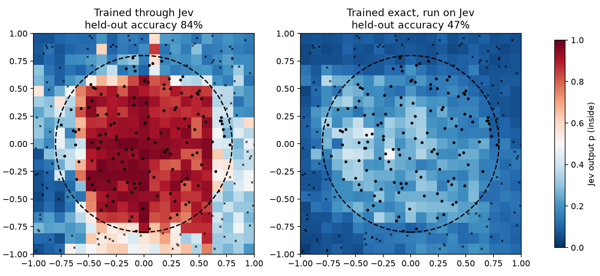

# Stage 3: a circular boundary from Jev neurons

2026-09-26 · 83,748 calls · $1.16 · model `jev-1.13.0` (TypeSafe direct)

Training through Jev works where swapping Jev in fails. A 2-6-1 network trained through live Jev neurons classifies held-out points at 84-88%. Networks trained with an exact neuron score 81-93% on the same points, but when their weights run on Jev they drop to 47-70%, which is at or below a linear classifier (62%). The gate (beat a linear classifier on held-out points) passes on 3 of 3 seeds.

Code: `src/jevrons/stage3.py`, figure from `src/jevrons/plots.py`. Results, weights, curves and boundary grids: `runs/stage3/`.

## Setup

Points are uniform in [-1, 1]², labeled inside when the radius is below 0.8 (53% of held-out points). 250 training and 250 held-out points. The network is 2 inputs, 6 hidden Jev neurons, 1 output Jev neuron, folded-bias products format, straight-through with τ = 0.3, Adam at 0.1, batch 16, 150 steps. Hidden biases start uniform in [-1, 1]. These settings were tuned locally on stand-in neurons before any Jev calls. Held-out accuracy averages 2 live passes.

## Results

| Seed | Trained through Jev, run on Jev | Same weights, exact neuron | Trained exact, exact neuron | Trained exact, run on Jev |
| --- | --- | --- | --- | --- |
| 0 | 84.2% | 80.4% | 93.2% | 47.2% |
| 1 | 86.2% | 77.2% | 90.0% | 47.2% |
| 2 | 88.4% | 86.8% | 81.2% | 70.2% |

Linear classifier on the same split: 62.4%.

Two things show up in every seed. The swap control collapses: in the figure, the exact-trained network run on Jev never pushes its output neuron above 0.5, so it calls everything outside. And the Jev-trained weights do better on Jev than on the exact neuron they were nominally approximating (84-88% vs 77-87%), so they've adapted to how Jev behaves rather than learning the ideal function and tolerating noise.

## Notes

Only 150 steps of batch 16 were run, so accuracy is not converged. The exact-trained networks also varied a lot by seed locally (47-86% across 10 seeds with these settings), so the swap gap per seed is noisy; the direction is consistent across all three. This stage ran before the Vercel backend was added, so every call went to TypeSafe directly, and its evaluation calls lack run tags (training calls are tagged by seed; results per run are in the result files).
