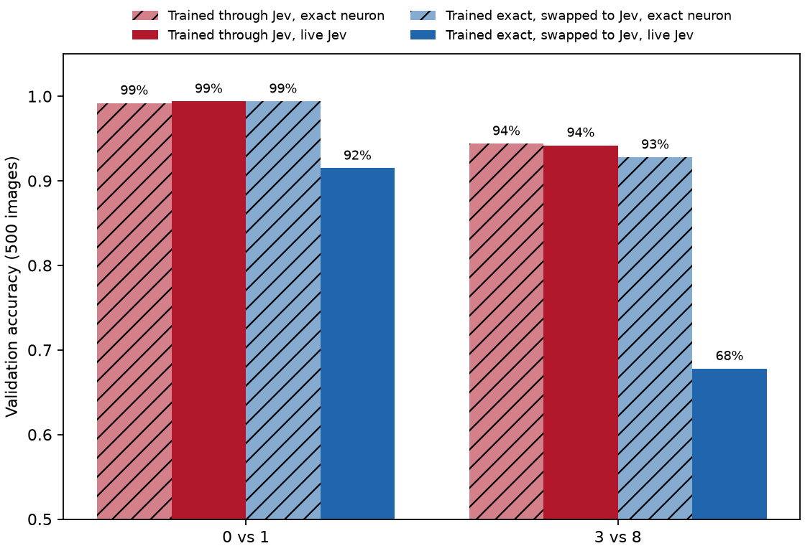

# Two digits: full-state Jev neurons on 0 vs 1 and 3 vs 8

2026-09-26 · 297,000 calls · 330.5M input tokens · $13.88 · TypeSafe direct (27%) and Vercel gateway (73%)

A network where every neuron is a live Jev call that adds up about 150 raw pixel products learns handwritten digits. Trained through Jev, it gets 99.4% on 0 vs 1 and 94.2% on 3 vs 8. A network trained with an exact neuron from the same initialization matches that on the exact neuron (99.4%, 92.8%), but swapping Jev in drops it to 91.5% and 67.8%. Training through Jev recovers 8 and 26 points. Gate passed (0 vs 1 above 95%).

Code: `src/jevrons/stage5.py`. Weights, curves and results: `runs/stage5/`.

## Setup

784-32-1, one seed per pair, 500 stratified training and 500 validation images from the training partition. Each neuron's state is the folded-bias products list of its nonzero inputs (about 150 terms for hidden neurons, 33 for the output), roughly 1,036 billed tokens per call. Straight-through with τ = 3, Adam at 0.02, batch 32, 5 epochs, weights initialized N(0, 0.3). These settings were chosen locally against `MockJevNeuron`, a stand-in fitted to the single-neuron probe's error-versus-margin curve, which predicted 3 vs 8 at 93.6% trained and 76.5% swapped. Validation averages 2 live passes.

## Results

| Pair | Arm | Exact neuron | Live Jev | Hidden fires as intended | Output fires as intended |
| --- | --- | --- | --- | --- | --- |
| 0 vs 1 | trained through Jev | 99.2% | 99.4% | 99.4% | 99.6% |
| 0 vs 1 | trained exact, swapped to Jev | 99.4% | 91.5% | 96.4% | 84.5% |
| 3 vs 8 | trained through Jev | 94.4% | 94.2% | 93.0% | 97.5% |
| 3 vs 8 | trained exact, swapped to Jev | 92.8% | 67.8% | 86.9% | 91.6% |

"Fires as intended" is how often Jev's yes/no matched the sign of the true sum for that neuron and image.

## What training changed

Jev-trained neurons fire as intended far more often than the single-neuron probe would predict for 150-term sums (93-99% here versus 80-90% on random states). The swap networks, with the same architecture and inputs, sit at 87-96%. Training moved the sums away from zero, where Jev adds reliably, as well as learning weights that tolerate the misfires that remain. The mock neuron did not model this, which is why it underestimated the swap gap on 0 vs 1.

This is one seed per arm. The [ten-digit experiment](stage6-ten-digits.md) repeats the comparison across seeds on all ten digits.
