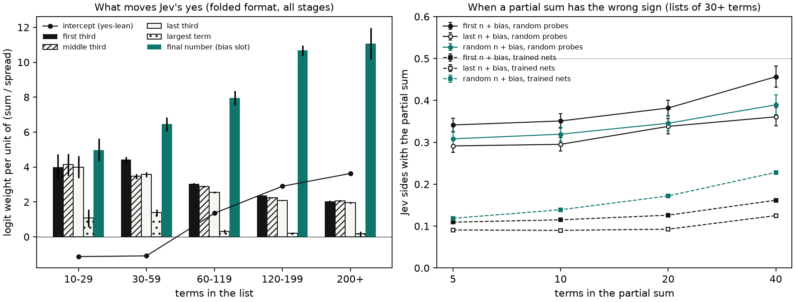
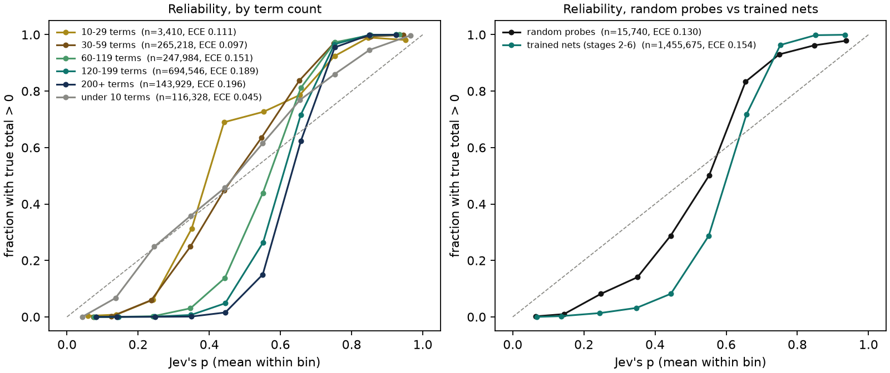
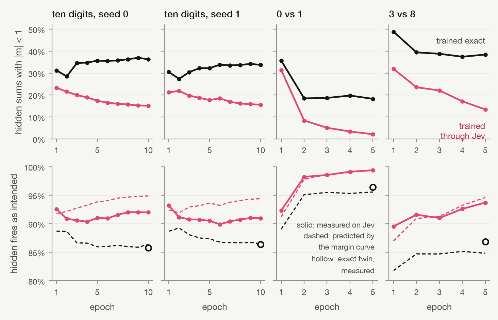
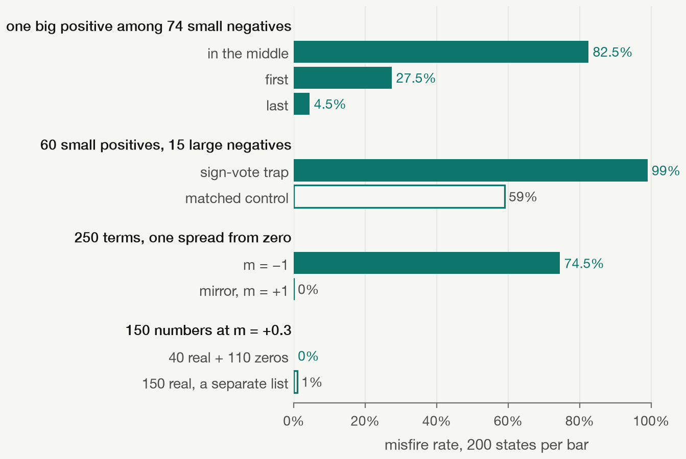
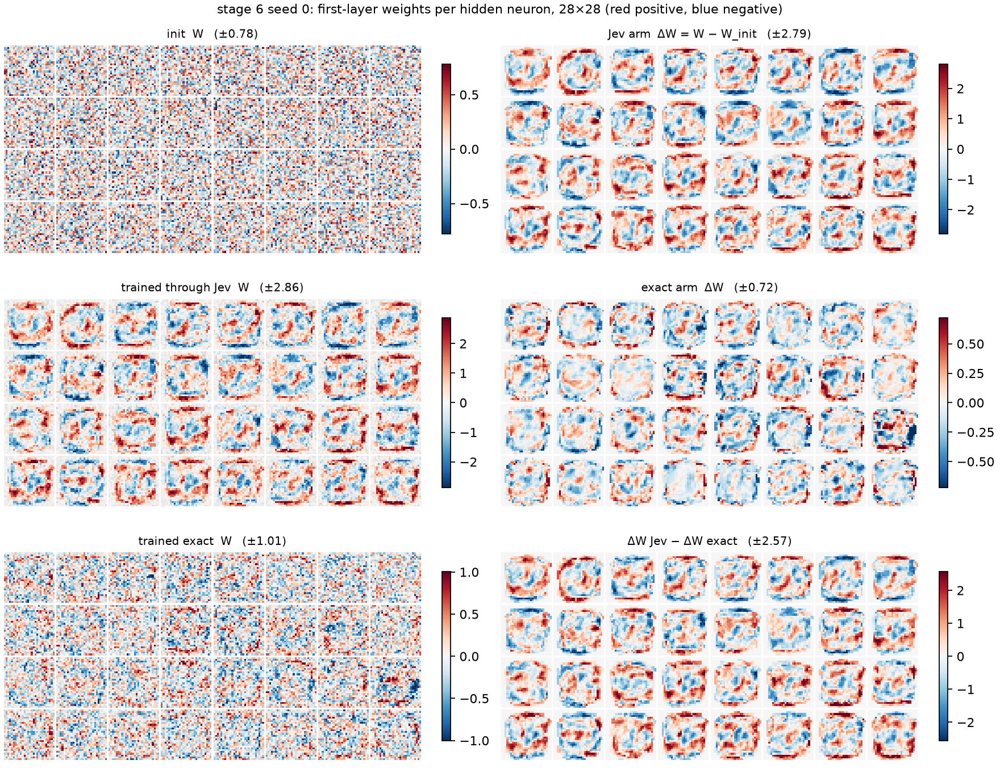
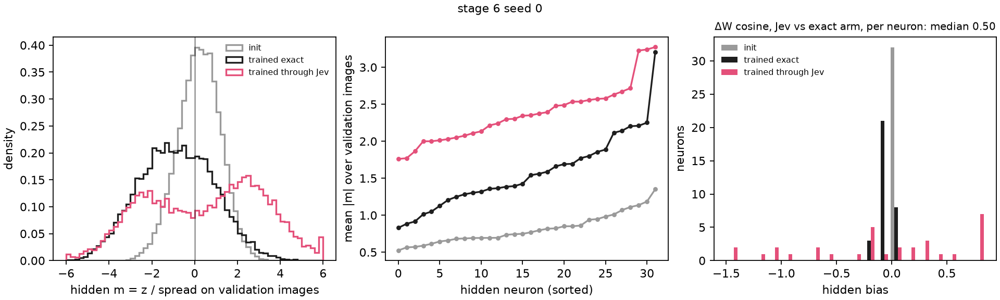
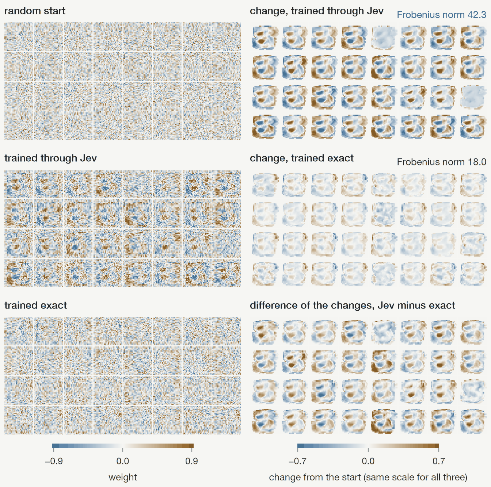
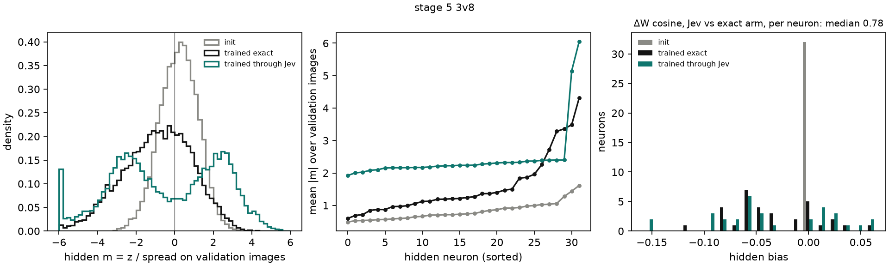
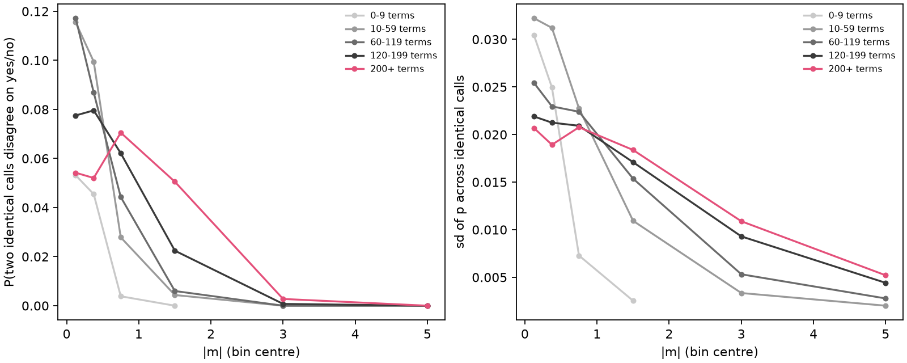

# Jev's quirks: what Jev's behaviour reveals

2026-09-26 · 1,471,415 journaled full-state calls analysed offline · 1,800 live trap calls, $0.075 · model `jev-1.13.0`

Jev isn't skimming the list, but it isn't only adding either: its yes/no also follows a sign vote over the terms, leans yes more the longer the list, reacts strongly to where one big number sits, and puts out a p that is compressed toward 0.5. Training through Jev finds and uses these quirks without being told about them. The Jev-trained networks push their hidden sums 1.6-1.8× as far from zero (in spreads) as exact-trained networks from the same start, and their first-layer weights end up 2-4× farther from init.

Optimization finds quirks you didn't know to look for. The single-neuron probe found the first one by accident: with a separate `bias` field, Jev followed the bias sign 72-97% of the time. Logic gates then showed training could only solve XOR once the bias was folded into the list. This experiment goes looking for the rest.

Code: `src/jevrons/stage6b_features.py` (streams the journals into `runs/stage6b/features.npz`), `src/jevrons/stage6b.py` (offline analysis and figures), `src/jevrons/stage6b_traps.py` (live traps). Numbers: `runs/stage6b/*.json`. The journals and `features.npz` aren't published, so the analysis reruns only where they exist.

## Data

Every call whose state was a neuron: the single-neuron probe (full, full2, wording; packed calls excluded), logic gates, the circle, two digits and ten digits, the margin probe and the backend check. z is recomputed from the state exactly as sent, so every call has a known true sign. The ten-digit experiment was still running, so its journal was read up to its size at the start (1,042,347 calls: seed 0 complete, seed 1 jev arm complete, seed 1 swap and seed 2 not yet run). Random probes are 15,740 calls; the rest come from trained networks, mostly 150-term hidden neurons from the two-digit and ten-digit runs.

m = z / spread, where spread = sqrt(sum of squared terms, bias included). In the folded format the bias is the list's final number.

## 1. What Jev's answer depends on

A logistic model of Jev's yes, fitted separately per term-count band on folded-format calls. The signed predictors are the sums of the first, middle and last third of the terms, the final number (the bias slot), and the largest term, each divided by the spread, plus a sign vote (share of positive terms minus share of negative) and the share of zero terms. The held-out 20% is split by state hash, so repeats of one state never straddle the split.

| Terms | Calls | Misfires | Weight: first ⅓ | middle ⅓ | last ⅓ | final number | sign vote | Intercept, margin-only fit | Held-out agreement with Jev: true sign / margin model / full model |
| --- | --- | --- | --- | --- | --- | --- | --- | --- | --- |
| 10-29 | 2,430 | 13.4% | 4.0 | 4.1 | 4.0 | 5.0 | 4.3 | −0.82 | 86.6% / 96.5% / 96.1% |
| 30-59 | 264,238 | 1.2% | 4.4 | 3.5 | 3.6 | 6.5 | 4.8 | −1.46 | 98.8% / 99.1% / 99.2% |
| 60-119 | 247,004 | 4.5% | 3.0 | 2.9 | 2.6 | 8.0 | 4.9 | +1.08 | 95.5% / 96.1% / 96.3% |
| 120-199 | 693,566 | 9.3% | 2.4 | 2.2 | 2.1 | 10.7 | 7.3 | +2.06 | 90.7% / 94.1% / 94.5% |
| 200+ | 143,029 | 10.9% | 2.0 | 2.1 | 1.9 | 11.1 | 7.2 | +2.94 | 89.1% / 94.3% / 94.7% |

Weights are logit per unit of (sum / spread); the vote is per unit of vote (−1 to 1). Standard errors are 0.01-0.4 except in the smallest band (full table in `runs/stage6b/error.json`).

What the table shows:

- **Length blur and yes-lean.** The weight per unit of sum falls from about 4 to 2 as lists grow, and the intercept goes from negative to +2.9. In the margin-only fit, the 50/50 point moves from m = +0.15 at 10-29 terms to m = −1.3 at 200+: on a long list, a total one spread below zero is still a coin flip. That's the same as the margin probe's fitted threshold (−1.1 at 250 terms).
- **Sign vote.** Beyond the sum, Jev counts signs. At 120-199 terms, a vote of +0.2 (60% of terms positive) is worth +1.5 logit, about the same as moving the total 0.6 spreads. In random probes the vote weight is smaller (1-4.3) but still positive.
- **Mild primacy.** The first third gets 5-24% more weight than the last third in every band of 30+ terms. That's small next to the other effects.
- **The final number still counts extra.** In folded lists the bias slot gets 1.2-5.5× the weight of an ordinary term, even though Jev can't know it's a bias. This is correlational (natural biases are small, median 3% of the spread). The traps below show the position effect is real but doesn't work the way this coefficient suggests.
- The extra features buy little prediction on top of the margin: held-out agreement with Jev rises by 0.1-0.4 points, and misfire AUC goes from 0.960-0.992 to 0.966-0.994 at 30+ terms. The margin and term count explain most of Jev's errors. Below 30 terms the full model is slightly worse than the margin model (96.1% vs 96.5%), which is overfitting on 2,430 calls.

The share-of-zero-terms weight is large and negative at 60+ terms (−3.5 to −15.6), but only trained networks produce zero products, so it's confounded with which images and neurons those are. The zero-padding trap below found no effect.

### Is Jev skimming the list? No

The single-neuron probe noted that "first 10 terms + bias" and "last 10 terms + bias" agreed with Jev about 91% of the time. On that probe, the bias was set to place the total at a chosen margin, so first-10-plus-bias mostly reproduced the bias's sign. Jev follows the bias, and the partial sum agreed with Jev (87-94%) more often than the true sign did (81-89%). It was the bias-trust quirk showing up again.

The direct test takes the cases where a partial sum has the wrong sign and asks which way Jev goes. A skimmer would side with the partial sum. On random probes with 30+ terms, Jev sides with it 29-46% of the time, and with the true total the rest:

| Partial sum (+ bias) | 5 terms | 10 | 20 | 40 |
| --- | --- | --- | --- | --- |
| First n | 34% (n = 3,377) | 35% | 38% | 46% |
| Random n (position-free null) | 31% | 32% | 35% | 39% |
| Last n | 29% | 30% | 34% | 36% |

Every value is below 50%, so Jev isn't reading a prefix. First-n beats random-n by 3-7 points and last-n trails it by 1-3, which matches the mild primacy in the regression. In trained networks the rates are 9-23%. The partial sums there are contiguous image regions, so the random-subset null doesn't carry over.

## 2. Calibration: p is not a probability

| Set | Calls | Brier | ECE | True-positive rate when 0.75 ≤ p < 0.85 | when 0.15 ≤ p < 0.25 |
| --- | --- | --- | --- | --- | --- |
| All full-state calls | 1,471,415 | 0.066 | 0.154 | 99.0% | 0.8% |
| Random probes | 15,740 | 0.107 | 0.130 | 94.2% | 4.0% |
| Trained nets (logic gates through ten digits) | 1,455,675 | 0.065 | 0.154 | 99.1% | 0.7% |
| 30-59 terms | 265,218 | 0.020 | 0.097 | 98.8% | 1.2% |
| 120-199 terms | 694,546 | 0.086 | 0.189 | 99.3% | 0.1% |

When Jev says p = 0.8, the total is positive 94-99% of the time, not 80%. The reliability curve is an S much steeper than the diagonal: p is squeezed into roughly 0.05-0.95 and says little about confidence at the ends. p rarely leaves that range: across all calls, 0.4% are at or below 0.02 and 0.9% at or above 0.98. The midpoint is also off. For p in 0.5-0.6 the total is positive only 29% of the time in trained networks (50% on random probes), so the real decision point sits nearer p ≈ 0.6 on long lists. That's the yes-lean again. Calibration gets worse with length (ECE 0.10 at 30-59 terms, 0.19-0.20 at 120+), but lists under 10 terms are close to calibrated (ECE 0.045).

That compression matters for training (see "What training changed").

## 3. Training dynamics: margin maximization, measured

For each arm and epoch, the hidden neurons' |m| on the training batches. The Jev arm's values come from its journaled training calls. The swap arm was retrained locally with a recording step neuron; the replay is deterministic and reproduces the saved weights exactly for ten-digit seed 0 and both two-digit pairs. The swap arm has no live calls during training, so its fires-as-intended rate is predicted from the margin-probe curve, and that prediction is checked against its live validation pass.

| Run | Arm | Median hidden \|m\|, epoch 1 → last | Share with \|m\| < 1 | 10th pct \|m\| | Fires as intended, last epoch (measured / curve) |
| --- | --- | --- | --- | --- | --- |
| Ten digits, seed 0 | Jev | 2.21 → 2.36 | 23% → 15% | 0.43 → 0.73 | 92.0% / 94.9% |
| Ten digits, seed 0 | exact | 1.63 → 1.41 | 31% → 36% | 0.32 → 0.27 | val 85.8% / 86.0% |
| Ten digits, seed 1 | Jev | 2.30 → 2.35 | 21% → 16% | 0.47 → 0.69 | 91.0% / 94.4% |
| Two digits, 0v1 | Jev | 1.76 → 4.09 | 31% → 2% | 0.30 → 2.60 | 99.4% / 99.4% |
| Two digits, 0v1 | exact | 1.44 → 2.39 | 36% → 18% | 0.27 → 0.59 | val 96.4% / 95.7% |
| Two digits, 3v8 | Jev | 1.60 → 2.32 | 32% → 13% | 0.31 → 0.81 | 93.7% / 94.6% |
| Two digits, 3v8 | exact | 1.03 → 1.36 | 49% → 39% | 0.19 → 0.25 | val 86.8% / 84.4% |

Epoch-1 values average over the whole epoch; both arms start from the same weights at step 0.

In every run, training through Jev empties the low-margin region where Jev is unreliable: the share of hidden sums within one spread of zero falls to 2-16%. Exact training leaves 18-39% there, and on ten digits that share grows. The margin curve predicts the exact arm's live fires-as-intended rate within 2.4 points, so the two-digit swap gap is mostly the margin distribution.

On ten digits the Jev arm's measured rate stays at 90-92% while its margins grow and the curve predicts 94-95%. The missing 3 points are yes-lean misfires. The share of intended fires rises from 42% to 57% over training, and Jev fires on 64% of calls by the end. The margin curve, fitted on random bias-0 lists, doesn't capture the sign-vote and length effects on these states.

## 4. Traps: states built to fool Jev

Five trap families, 200 states each. Each has a matched control with the same term count, total and spread (so the same m to within 0.01), differing only in the trap feature. Pairs are analysed as paired differences. Folded format, standard question, 1,800 calls, $0.075 (estimate before sending: $0.072).

| Family | Trap state | Control | Misfire: trap | control | Difference (95% CI) |
| --- | --- | --- | --- | --- | --- |
| Big number last | 74 small negatives, then one +4.9 (98% of the spread), m = −0.5 | same numbers, big one in the middle | 4.5% | 82.5% | −78 pts (−84, −72) |
| Big number first | same, big one first | same control | 27.5% | 82.5% | −55 pts (−64, −46) |
| Sign vote | 60 small positives, 15 large negatives, m = −0.5, 75 terms | 38 positive, 37 negative, same total and spread | 99.0% | 59.0% | +40 pts (+33, +47) |
| Long list | 250 mixed terms, m = −1.0 | mirror image, m = +1.0 | 74.5% | 0.0% | +74.5 pts (+68, +81) |
| Zero padding | 40 real terms + 110 zeros, m = +0.3 | 150 real terms, same total and spread | 0.0% | 1.0% | −1 pt (−2.4, +0.4) |

Three traps beat their controls: the sign vote, the long-list yes-lean, and a big number placed mid-list. The yes-lean trap is strong. A 250-term list whose total is a full spread below zero fires 74.5% of the time, and its mirror image never fails.

The position family went the opposite way to its prediction. The error model suggested the final number is overweighted, so a big positive number in the bias slot should drag Jev to yes. Instead, the identical list fools Jev 82.5% of the time when the big number is in the middle, 27.5% when it's first, and 4.5% when it's last. Jev seems to take in a dominant number at either end correctly and misjudge one buried among small terms. The data doesn't say why. The regression's bias-slot weight comes from small natural biases and doesn't extrapolate to one number carrying 98% of the spread.

Padded lists (40 real terms and 110 zeros) misfired on 0% of states against 1% for separately generated 150-term lists with the same total and spread. That isn't the same list before and after padding, but zeros didn't make Jev worse, so the large zero-share coefficient in section 1 is more likely a confound in the trained-network data than a property of Jev.

## 5. Weight maps and what training changed

Both arms share their initialization (`stage6.init(seed)`, `stage5.init(0)`), so ΔW = W − W_init is exact for each arm. Ten-digit seed 1's swap arm hadn't finished, so only seed 0 is compared.

| | Ten digits, seed 0: Jev | exact | Two digits, 3v8: Jev | exact |
| --- | --- | --- | --- | --- |
| ‖ΔW1‖ (Frobenius) | 152.8 | 36.5 | 42.3 | 18.0 |
| ‖ΔW2‖ | 48.5 | 3.5 | 1.39 | 0.61 |
| Cosine ΔW1 Jev vs exact: overall / per-neuron median | 0.49 / 0.50 | | 0.72 / 0.78 | |
| Share of Jev ΔW1 explained by the exact arm's ΔW1 (least squares) | 24% | | 51% | |
| Mean \|w\| on digit pixels (init 0.24) | 0.79 | 0.29 | 0.33 | 0.25 |
| Share of \|w\| < 0.05 on digit pixels (init 12%) | 3.9% | 11.3% | 9.7% | 12.1% |
| Share of weights positive on digit pixels | 51.6% | 46.2% | 48.3% | 46.8% |
| Hidden bias: mean (range) | −0.10 (−1.51, 0.85) | −0.06 (−0.23, 0.08) | −0.034 (−0.16, 0.06) | −0.035 (−0.11, 0.06) |
| Output bias change, mean | −1.11 | −0.13 | −0.17 | −0.03 |
| Per-neuron mean \|m\| on validation, median (init 0.76 / 0.73) | 2.35 | 1.48 | 2.23 | 1.23 |
| Hidden share with \|m\| < 1 on validation (init 67%) | 18% | 38% | 15% | 40% |
| Intended hidden fire rate on validation (init 59%) | 57% | 33% | 46% | 34% |
| Output-layer participation ratio (of 32) | 31.5 | 21.2 | 28.0 | 16.1 |

"Digit pixels" are the 336-352 pixels present in at least 10% of training images. Pixels that are always zero get no gradient in either arm, since the gradient of W1 is Xᵀ·dz. So the untouched border in the ΔW maps is the same in both arms and isn't a Jev effect.

The ΔW maps look like digit detectors in both arms, but the Jev arm's are larger and smoother. On 3 vs 8 they mark the gaps on the left of the 3 where an 8 has ink. Half or more of the Jev arm's change has no counterpart in the exact arm (24% explained on ten digits, 51% on 3 vs 8).

Margins grow more under Jev training. Per-neuron mean |m| is 3.1× init for the Jev arm versus 2.0× for the exact arm on ten digits (3.0× vs 1.7× on 3 vs 8). The Jev arm's validation margins are bimodal, with a trough at zero: it pushes sums out of the band where Jev is unreliable. m is scale-invariant, so this isn't just bigger weights. The products have to become more sign-consistent within each sum, which is also what Jev's sign vote rewards.

The yes-lean prediction isn't supported. If training compensated for over-firing on long sums, Jev-trained sums (through biases or the mean of ΔW) would drift negative relative to the exact arm, especially on images with more active pixels. They drift the other way. The median change in a neuron's mean z is +4.1 for the Jev arm and −3.5 for the exact arm on ten digits (−0.8 vs −3.0 on 3 vs 8). The Jev arm's intended fire rate stays near 46-57% while the exact arm's falls to 33-34%. By image length on ten digits, the Jev arm's intended fire rate rises from 52% on the shortest third of images to 60% on the longest, while the exact arm's falls from 34% to 31%. The hidden biases barely move in either arm on 3 vs 8 (mean −0.034 vs −0.035). Training doesn't learn to counter the lean. It moves sums far enough from zero that the lean matters less, and on ten digits it still costs about 3 points of hidden accuracy (section 3).

The Jev arm moves much farther, and that follows from the calibration finding. The output loss gradient is p − y. Jev's p almost never leaves 0.04-0.96 (the ten-digit Jev arm's output calls had min 0.04 and max 0.92), so every training example keeps pushing its margin outward, like logistic regression. With an exact step neuron the output is 0 or 1, and correctly classified examples give no gradient, like a perceptron. That explains the 14× larger ‖ΔW2‖, the output biases dragged down by 9 of 10 targets being 0 (−1.11 vs −0.13), and a Jev network that almost never fires an output (97% of test images have no output p ≥ 0.5) yet classifies at 71% by comparing graded p's. It's a plausible mechanism, not a tested one.

In the output layer, the Jev arm spreads its weight across nearly all 32 hidden neurons (participation ratio 31.5 vs 21.2; on 3 vs 8, 28.0 vs 16.1). It doesn't lean on the hidden neurons Jev runs most reliably. The correlation between a neuron's output-weight norm and its measured fires-as-intended rate is −0.13 on ten digits and −0.31 on 3 vs 8, against +0.35 and +0.29 in the exact arm.

## 6. Repeat noise and backends

Repeat noise sits at small margins. Among 80,358 states that were called more than once (single-neuron probe repeats and wording, logic gates, the circle, the margin probe, the backend check, and the two-digit runs' two validation passes; the ten-digit runs never repeat a state), two identical calls disagree on yes/no 1.6-3.1% of the time overall. Half of all disagreement sits at |m| < 0.5, which holds 12% of the repeated states. The flip probability is 5-12% at |m| < 0.25, under 1% beyond |m| = 2, and zero beyond 4 in every term-count band. Long lists stay noisy further out: at 200+ terms it's still 5% at |m| of 1-2, against under 1% below 120 terms. The sd of p across repeats is 0.02-0.03 near zero and 0.002-0.005 at large margins.

At the scale of the two-digit and ten-digit runs, the backends are no longer indistinguishable. Comparing hidden-neuron calls within matched cells of (term count, |m|, true sign, neuron index), 1.07M calls in 1,945 cells:

| Hidden calls, typesafe − vercel | Fire rate | Fires as intended | SE |
| --- | --- | --- | --- |
| All | −0.74 pts | +0.62 pts | 0.04 |
| True total ≤ 0 | −1.31 pts | +1.31 pts | 0.08 |
| True total > 0 | −0.13 pts | −0.13 pts | 0.03 |
| Two digits only | −0.51 pts | +0.42 pts | 0.06 |
| Ten digits only | −0.74 pts | +0.64 pts | 0.05 |

The gateway fires slightly more often, almost all of it on negative totals, so it has a little more yes-lean. The raw hidden fires-as-intended rate is 92.1% on typesafe and 91.6% on vercel. The difference is consistent across stages, splits and neurons. On output neurons, where margins are large, there's no difference (−0.01 ± 0.03 pts). The backend check (100 states × 3 repeats) couldn't resolve a gap this size. For the networks it doesn't matter: 0.6 points of hidden accuracy is well below the arm-to-arm differences. But the two backends aren't bit-for-bit the same neuron. The gateway only exposes the unversioned `typesafe-ai/jev` alias, and whether it serves exactly `jev-1.13.0` can't be checked from the responses. Only 260 identical-state pairs landed on different backends, too few to compare per state (flip 2.3% cross-backend vs 1.7% same-backend).

## Caveats

- Nearly all calls come from trained networks, mostly 150-term hidden neurons, so the pooled models are weighted toward that regime. Trained-network features (zeros, vote, image position) are correlated with each other and with the network state. That's why the traps exist: of the five, three confirmed a prediction, one reversed it, and one showed a confound.
- The ten-digit journal was read mid-run: seed 0 complete, seed 1 Jev arm only, seed 2 absent. The weight comparison is one seed on ten digits and one pair on two.
- The logistic model predicts Jev's answer about as well as the margin alone plus 0.1-0.4 points. It's a description of which features move Jev, not a model of how Jev computes.
- The trap families each test one construction at one term count and margin. The position result is large but its cause is untested.

13 trap calls hit repeated 429s on the gateway (it shares a rate limit with the ten-digit runs) and failed over to typesafe. All 1,800 got answers.
