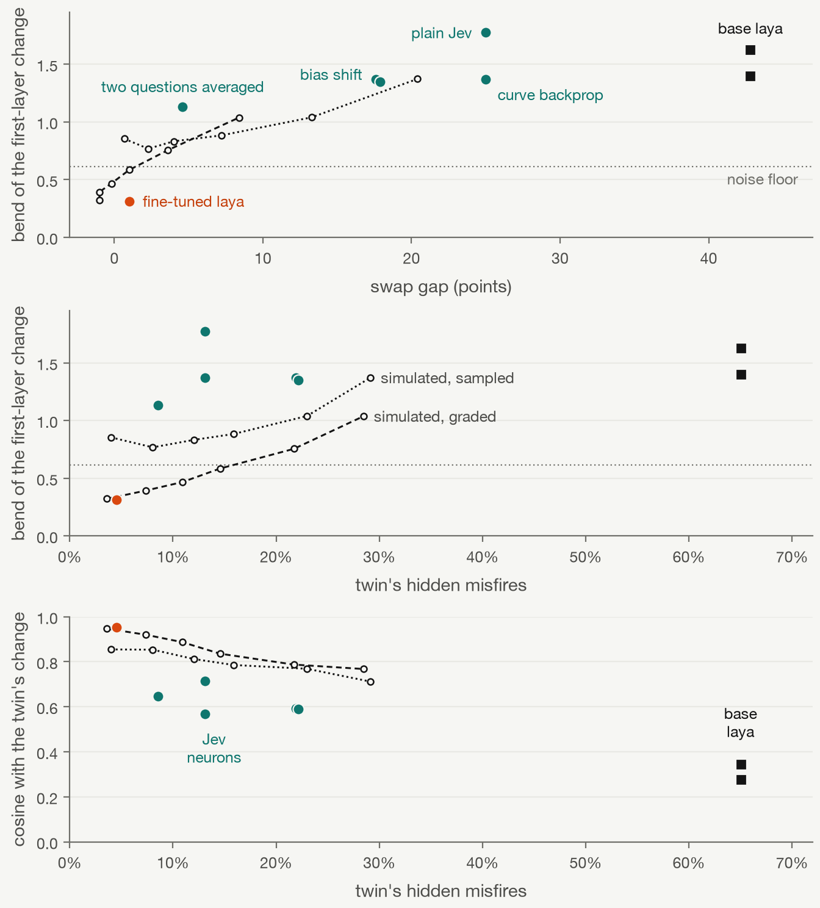
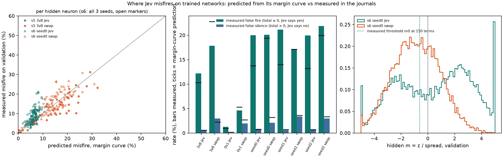
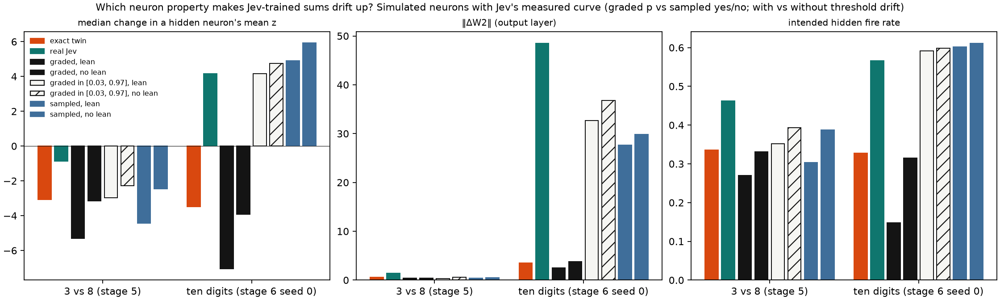
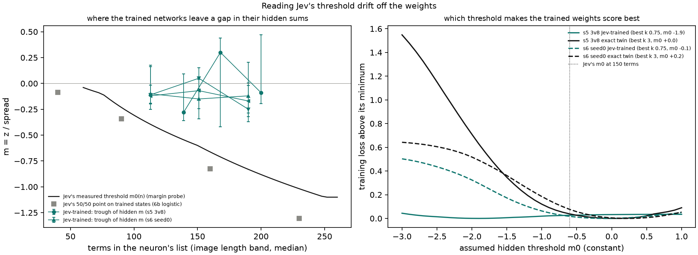
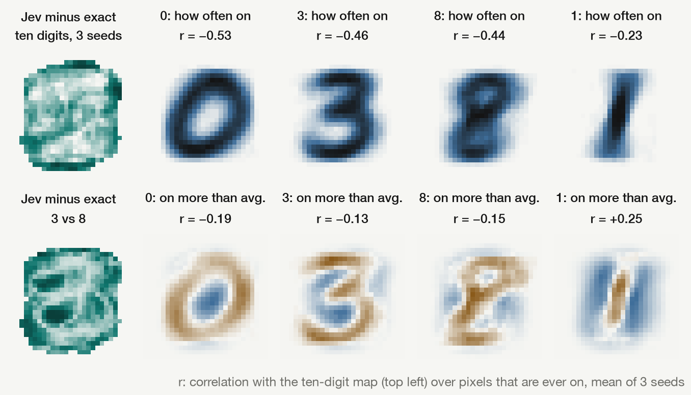

# Reading the weights: the weights as a probe of Jev

2026-09-27 · offline only · no Jev or Ollaya calls · $0

A more faithful neuron does give weights closer to the exact solution, but only at the ends of the range, and Jev arms bend much farther than their neuron's misfire rate explains. On 3 vs 8, the plain Jev network's first-layer change is 1.77× its exact twin's change away from it. Arm E, the most faithful Jev neuron (swap gap 4.6 points), still bends 1.13; fine-tuned laya (gap 1 point) bends 0.31. A simulated neuron with Jev's own measured curve and a similar misfire rate bends only 0.58 (graded p) or 0.88 (sampled yes/no). The weights don't read out Jev's threshold drift. The upward drift of Jev-trained sums that [Jev's quirks](stage6b-jev-quirks.md) couldn't explain does reproduce in simulation, and the cause is Jev's p never reaching 0 or 1, not its yes-lean.

Code: `src/jevrons/stage6c_calls.py` streams the two-digit, ten-digit and two-question neuron journals' validation and test calls into `runs/stage6c/calls.npz` (804,000 calls, 10 s). `src/jevrons/stage6c.py` runs the analyses (`uv run python -m jevrons.stage6c [bend misfire lean readoff pixels]`, about 2 minutes). Numbers: `runs/stage6c/*.json`.

## Setup

Every network is compared with its exact twin: same init, data and schedule, trained with an exact step neuron. For the two-digit twin, a local replay reproduces the saved weights exactly. ΔW = W − W_init. Bend = ‖ΔW_arm − ΔW_twin‖ / ‖ΔW_twin‖. The least-squares share of the arm's change explained by the twin's is cos², so only the cosine is tabulated.

Two controls were added, both local and both on the two-digit recipe:

- Recipe-matched twins. The two-question neuron experiment changed the backward pass as well as the neuron, so B-E were also compared with an exact twin trained with their backward pass.
- Simulated neurons of known faultiness. Jev's measured curve (`runs/margin`), P(fire) = Φ(k(n)/λ · (m − λ·m0(n))), with λ from 0.25 to 2. The neuron returns either the graded probability or a sampled yes/no (0.97/0.03). Three sampling seeds give a coin-flip noise floor: two runs of the same sampled neuron bend 0.53-0.82 relative to each other.

## 1. Bend against faultiness (3 vs 8)

| Arm | Swap gap (pts) | Twin's hidden misfire on this neuron | W1: bend / cos / ‖Δ‖ ratio | b1 bend / cos | W2 bend / cos | b2: Δ ratio to twin | Hidden sign disagreement with twin (val) |
| --- | --- | --- | --- | --- | --- | --- | --- |
| Plain Jev (two digits) | 25.0 | 13.1% | 1.77 / 0.72 / 2.35 | 0.80 / 0.77 | 2.83 / −0.40 | 6.0× | 29.8% |
| Two-question B (same neuron, curve backward) | 25.0 | 13.1% | 1.37 / 0.57 / 1.66 | 1.76 / 0.55 | 2.91 / −0.42 | 5.1× | 28.1% |
| Two-question C (pre-compensated) | 17.6 | 21.9% | 1.37 / 0.59 / 1.70 | 1.39 / 0.69 | 3.54 / −0.34 | 4.4× | 23.4% |
| Two-question D (C + 3 phrasings) | 17.9 | 22.2% | 1.35 / 0.59 / 1.67 | 1.34 / 0.72 | 3.36 / −0.35 | 4.4× | 23.4% |
| Two-question E (yes/no + choice) | 4.6 | 8.6% | 1.13 / 0.65 / 1.48 | 1.10 / 0.81 | 2.16 / −0.31 | 3.0× | 19.0% |
| Laya as a neuron, laya-hidden (scalar) | 42.8 | 65% | 1.62 / 0.28 / 1.58 | 2.38 / 0.52 | 3.87 / −0.42 | 3.1× | 26.3% |
| Laya as a neuron, all-laya (scalar) | 42.8 | 65% | 1.40 / 0.34 / 1.38 | 1.32 / 0.40 | 1.18 / −0.42 | 0.6× | 26.0% |
| 10 laya-neuron (sparse, own twin) | 1.0 | 4.5% | 0.31 / 0.95 / 1.02 | 0.12 / 0.99 | 0.32 / 0.95 | 1.1× | 1.8% |
| Simulated λ = 1, graded | 1.0 | 14.6% | 0.58 / 0.84 / 1.03 | 0.57 / 0.93 | 0.77 / 0.65 | 0.3× | 11.2% |
| Simulated λ = 1, sampled (3 seeds) | 7.2 | 15.9% | 0.88 / 0.79 / 1.42 | 0.81 / 0.83 | 0.81 / 0.56 | 1.2× | 18.9% |
| Simulated λ = 2, sampled | 20.4 | 29.2% | 1.37 / 0.71 / 1.89 | 0.93 / 0.78 | 1.61 / −0.25 | 3.6× | 27.2% |

The graded simulator's misfire counts its deterministic answers on the wrong side of 0.5 (14.6% at λ = 1); the sampled one's is the expected rate of its coin flips (15.9%). The b2 column is |Δb2| divided by the twin's |Δb2|. Every arm moves b2 the same way as its twin (downward). Laya's "misfire" in the laya-as-a-neuron runs is scored against the sign, which its V-shaped curve was never meant to follow.

With the recipe matched, the Jev arms bend 1.43 (B), 1.48 (C), 1.45 (D) and 1.17 (E). The backward pass alone moves an exact twin 0.71-0.90 away from the two-digit twin. B has the same neuron as plain Jev and bends 0.40 less against the shared twin, so the recipe accounts for as much of the plain-vs-two-question difference as the neuron does.

What this shows:

- Within the simulated family, bend rises steadily with faultiness: graded 0.32 → 1.04 and sampled 0.85 → 1.37 as λ goes 0.25 → 2. The swap gap rises from −1 to 20 points. So in principle bend tracks the neuron's fault.
- The real arms follow that ordering only coarsely. E (gap 4.6) bends least among the Jev arms and laya-neuron (gap 1) least of all, at the level of the λ = 0.25 simulation. But C and D cut the gap from 25 to 18 without bending any less than B, and the two laya-as-a-neuron arms (gap 43) bend no more than plain Jev.
- Jev bends more than its curve predicts. At a matched twin misfire rate (13-16%), simulated neurons bend 0.58-0.88, and the real plain arm bends 1.77. Even E, at 8.6% misfire, bends more (1.13) than the sampled λ = 2 neuron at 29%. The curve doesn't reproduce the gap either: the twin loses 1-7 points on the simulated λ = 1 neuron and 25 on real Jev. The misfire rate alone doesn't set either one. Something in Jev beyond its margin curve (the sign vote and length effects from Jev's quirks, correlated errors across neurons) drives both.
- The output layer carries the clearest mark. Every Jev arm changes W2 in a direction opposed to its twin's (cos −0.31 to −0.42), and so does laya as a scalar neuron. Simulated neurons keep W2 aligned (cos +0.23 to +0.73 through λ = 1.5, in all but one run) and only turn it at λ = 2. Laya-neuron keeps it aligned (0.95).

## 2. What the weights say about where Jev misfires

For every hidden call on validation, the margin curve predicts P(misfire) from the call's m and term count. That's compared with Jev's measured answer (mean of the passes in the journal).

| Network | Measured misfire | Curve predicts | Measured false fire (total ≤ 0) | false silence (total > 0) | Share of misfires that are false fires | Per-neuron r, curve vs measured |
| --- | --- | --- | --- | --- | --- | --- |
| 3v8 Jev-trained | 6.8% | 5.8% | 12.2% | 0.6% | 96% | 0.71 |
| 3v8 twin on Jev | 12.8% | 15.9% | 17.8% | 3.0% | 92% | 0.90 |
| 3v8 two-question B | 4.6% | 4.7% | 9.1% | 0.7% | 92% | 0.92 |
| 0v1 Jev-trained | 0.7% | 0.6% | 1.3% | 0.0% | 99% | 0.96 |
| 0v1 twin on Jev | 3.5% | 4.2% | 4.6% | 2.0% | 77% | 0.93 |
| Ten digits, Jev-trained (3 seeds) | 8.6-9.8% | 5.8-6.7% | 19.9-21.1% | 0.6-0.9% | 95-97% | 0.64-0.70 |
| Ten digits, twin on Jev (3 seeds) | 13.7-16.3% | 13.7-15.1% | 17.2-21.9% | 2.1-3.4% | 94-95% | 0.69-0.90 |
| Init (curve only) | | 21-22% | | | | |

Jev's errors on trained networks are almost all false fires: 92-99% of misfires are a yes on a total at or below zero. The curve ranks neurons well on exact-trained networks (r 0.69-0.93) and less well on Jev-trained ones (r 0.64-0.71). On ten digits it misses a third of the Jev-trained networks' misfires, all of them false fires (curve 13-14% against measured 20-21%). That's the missing 3 points from Jev's quirks, now located.

Training through Jev takes predicted misfires from 21-22% at init to 6-7%, against 14-16% for the twin. It does that by pushing both sides away from zero, not by favouring the negative side where the lean bites. The Jev arm's median negative and positive m are −2.3 to −2.7 and +2.1 to +2.4 on 3 vs 8, and −2.1 to −2.4 and +2.3 to +2.8 on ten digits. The twin is the lopsided one (−1.5 to −2.0 against +0.8 to +1.0). Relative to its twin, the Jev arm gained more margin on the positive side (+1.2 to +2.0) than on the negative side (+0.4 to +1.0), which is the opposite of compensating for the yes-lean.

Nothing is tuned to image length either. In these dense networks the term count belongs to the image, not the neuron, since every hidden neuron sees the same nonzero pixels. On the longest third of images the Jev arm's false fires still rise with length as steeply as the twin's: 3 vs 8 goes 7% → 13% → 16% against the twin's 14% → 17% → 22%. On ten digits the Jev arm goes 11-12% → 22-24% → 27-30%, higher than its twin on long images (21-26%). Per-neuron compensation isn't supported. Across neurons, the length of the images where a neuron sits near zero doesn't predict a larger negative margin in the Jev arms (r −0.10 to +0.27).

## 3. The yes-lean seen from the weights

Jev's quirks found that Jev-trained hidden sums drift up relative to exact training. Three explanations were tested.

**(a) The output layer compensates. Not supported.** Take Jev's measured hidden answers minus the exact steps on validation. That's +0.27 to +0.35 on negative sums (false fires, plus p above 0) and −0.17 to −0.20 on positive sums (p below 1). The net effect on the output sums is negative (3 vs 8: −0.25 output spreads; ten digits: −0.20 to −0.59), and b2 moves the same way (−0.17; −0.6 to −1.8 per output), adding to the shift rather than cancelling it. The Jev-trained 3 vs 8 output layer does tolerate its hidden answers: they flip 1.4% of output decisions, against 20.6% for the twin on Jev. That tolerance comes from output margins, not an offset. On ten digits both arms flip 9-12%.

**(b) Hidden neurons turn into constant or bias units. Not supported.** Jev-trained networks have fewer near-constant hidden units than their twins, not more. The count of units that Jev fires on ≥95% or ≤5% of images is 2 vs 7 on 3 vs 8 and 0 vs 0-4 on ten digits, and the median per-neuron sd of p is 0.26-0.40 against 0.17-0.30. Two neurons per ten-digit Jev seed sit mostly above m = +2, against none in the twins.

**(c) Graded-p dynamics. Supported on ten digits, not on 3 vs 8.** Simulated neurons with Jev's curve, trained on ten-digit seed 0's recipe, separate the properties:

| Ten digits, seed 0 | Median change in a neuron's mean z | ‖ΔW2‖ | Mean Δb2 | Intended hidden fire rate |
| --- | --- | --- | --- | --- |
| Exact twin | −3.5 | 3.5 | −0.14 | 33% |
| Real Jev | +4.2 | 48.5 | −1.11 | 57% |
| Simulated, graded p, with lean / without | −7.1 / −3.9 | 2.5 / 3.8 | −0.06 / −0.10 | 15% / 32% |
| Simulated, graded p squeezed into [0.03, 0.97], with / without lean | +4.2 / +4.7 | 32.7 / 36.7 | −0.64 / −0.74 | 59% / 60% |
| Simulated, sampled yes/no (0.03 / 0.97), with / without lean | +4.9 / +5.9 | 27.7 / 29.9 | −0.54 / −0.58 | 60% / 61% |

Squeezing p away from 0 and 1 is enough to reproduce the drift, the fire rate, the order-of-magnitude larger ‖ΔW2‖ and the dragged-down output biases. The threshold drift doesn't matter: without it the drift is slightly larger. With an unsqueezed graded p the sums drift down, and farther than the twin's once the lean is on. This supports the untested mechanism from Jev's quirks. An output p that can't reach 0 or 1 keeps a gradient on every example, like logistic regression. The loss gradient then pulls nine of ten outputs down, and the hidden layer follows. It's also why the naive compensation prediction fails: the drift isn't a reaction to the lean at all.

On 3 vs 8 no simulated neuron drifts up (−2.3 to −5.3; twin −3.1; real Jev −0.9), so the smaller downward drift there isn't explained. The single output neuron and two classes don't produce the nine-of-ten pull.

## 4. Reading Jev's threshold off the weights: not supported

Two estimators, neither using probe data.

**Gap in the sums.** Jev-trained networks leave a trough in the density of hidden m (Jev's quirks). If they had learned Jev's threshold, the trough would sit at m0(n): −0.4 to −0.9 across the three image-length bands, deepening with length. It sits at −0.28 to +0.30 on 3 vs 8 and −0.25 to +0.05 on ten digits (bootstrap 95% intervals mostly include 0), with no trend in length. Exact twins have no trough at all. The networks cleared out the region around the true zero, not around Jev's drifted threshold.

**Likelihood.** Which constant hidden threshold m0 and blur k, with the output neuron on Jev's measured curve, make the trained weights score best on their own training set?

| Network | Best k | Best m0 at best k | m0 at k = 2 | Twin at k = 2 | Jev − twin at k = 2 |
| --- | --- | --- | --- | --- | --- |
| 3v8 Jev-trained | 0.75 (grid edge) | −1.9 | −1.6 | +0.2 | −1.8 |
| Ten digits seed 0, Jev-trained | 0.75 (grid edge) | −0.1 | −0.4 | +0.3 | −0.7 |
| Simulated 3v8, graded, with lean / without | 2 / 2 | −0.3 / +0.2 | −0.3 / +0.2 | +0.2 | −0.5 / 0.0 |
| Simulated 3v8, sampled, with lean / without | 0.75 / 0.75 | −0.6 / −0.5 | −1.0 / −0.6 | +0.2 | −1.2 / −0.8 |

Jev's own threshold at the median 3 vs 8 image (165 terms) is −0.69 on the margin probe and about −0.8 on trained states (Jev's quirks). The ten-digit estimate relative to its twin (−0.7) happens to land there. The 3 vs 8 one is 2.6× too far. The controls show why neither can be trusted. A sampled neuron with no threshold drift at all reads −0.8 below its twin, two-thirds of the −1.2 the drifting one gets. The estimator responds to how noisy the neuron is, not where its threshold sits. The blur k runs to the edge of the grid for every noisy neuron, so it isn't identifiable either. The network didn't measure Jev's threshold by learning around it, at least not in a form these weights reveal.

## 5. Which pixels pay: not the digits' pixels

Per pixel, the norm over hidden neurons of ΔW_Jev − ΔW_exact is almost the same map in all three ten-digit seeds (r = 0.96-0.97 between seeds, from different inits). It's a ring on the edge of the digit area. It correlates negatively with how often a pixel is on (r −0.50 to −0.54 over live pixels). The rms per-weight change in the Jev arm is 1.4-1.5 on pixels on in 1-10% of images and 0.8-0.9 on pixels on in over 40%. The twin has the same profile at a quarter of the size (0.31-0.33 vs 0.17-0.21). No weight hit the ±9.99 clip. A likely reading is Adam: it takes near-full-size steps on any coordinate with a persistent gradient, and Jev's never-zero p keeps one alive on rarely-used pixels. That wasn't tested separately.

| Ten digits, seed 0 | 0 | 1 | 3 | 8 | Mean of others |
| --- | --- | --- | --- | --- | --- |
| Share of live pixels "on" (≥50% of the digit's images) | 40% | 16% | 31% | 38% | 29% |
| Share of the squared difference on those pixels | 21% | 10% | 17% | 20% | 16% |
| Corr of difference with pixels the digit uses more than average (3 seeds) | −0.18 to −0.20 | +0.25 | −0.11 to −0.15 | −0.11 to −0.17 | −0.02 to +0.15 |
| Twin on Jev, test accuracy (ten digits) | 7% | 82% | 17% | 5% | |

The differences don't sit on the pixels that 0, 3 and 8 use. Those digits' pixels carry about half their share of the difference, and the pixels those digits use more than average are slightly avoided. On 3 vs 8 the 3's pixels carry 11% of the difference against 31% of the pixels. The swapped networks' failure on 0, 3 and 8 is a matter of how long their lists are (190, 165 and 172 active pixels on average, against 85 for a 1), not of specific pixel weights that Jev training rewrote.

## 6. Jev repeats its own mistakes

The 3 vs 8 validation in two digits asked every hidden call twice. When Jev misfired on a call the first time, it misfired on the same call again 88% of the time (Jev-trained network) and 86% (twin). If each call misfired independently with the probability the margin curve gives it, the repeat rate would be 52-59%. Jev's p jitters between repeats, but its decision barely moves: its mistakes belong to the list, not to the draw.

How misfires spread across images is not the difference. Independent sampling from the curve reproduces the per-image clustering: in the Jev-trained network the worst 5% of images hold 34% of misfires, the curve predicts 29-36%, and the twin gets 10% for both. The curve gets the rate and the placement roughly right and the persistence wrong.

This fits two earlier results. Averaging three yes/no phrasings (two-question arm D) added nothing, and averaging yes/no with a choice question (E) cut the gap from 25 to 4.6. Asking again, or rewording, draws the same wrong answer. A different format draws a different one. It also means the simulated neurons above, which flip a fresh coin every call, model a friendlier neuron than Jev. It doesn't by itself explain the larger swap gap, since a single pass sees one draw either way. Code: `src/jevrons/stage6c_repeat.py`, output `runs/stage6c/repeat.log`.

## Caveats

- One seed per 3 vs 8 arm, and the noise floor says two runs of a noisy neuron can differ by 0.5-0.8 in bend on their own. Differences of 0.1-0.3 between two-question arms are within it. The plain-vs-E and Jev-vs-laya-neuron differences are not.
- The two-question arms differ from the two-digit baseline in the backward pass too. The recipe-matched twins separate that, but they're exact twins no real run had.
- The network from teaching laya to add is sparse (64 weights per hidden neuron), uses a different neuron and has its own twin, so its bend is comparable in kind, not directly. The laya-as-a-neuron runs use laya as a scalar neuron, whose V-shaped curve isn't a noisy step, so its misfire rate and gap don't mean the same thing as Jev's.
- The simulated neurons are Jev's margin curve and nothing else. They reproduce neither the size of Jev's swap gap nor its bend, so they bound what the curve explains rather than modelling Jev.
- The per-call predictions use the margin probe's curve, fitted on random lists. The logistic model from Jev's quirks is an in-sample alternative for the two-digit and ten-digit runs. It predicts the ten-digit Jev misfires better (7.5-8.5%) and the twins worse.
- The dense network had no saved weights when this ran, so it isn't included.
